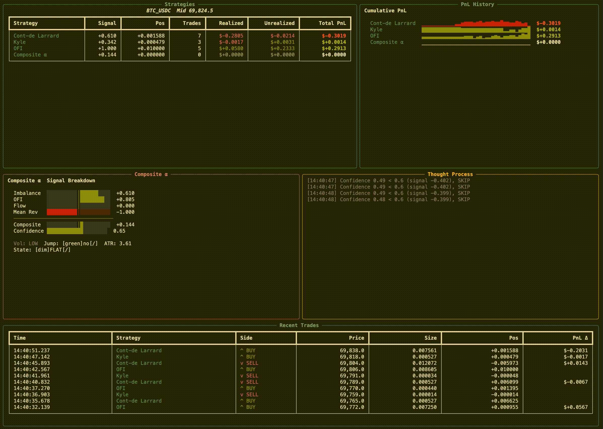

# Deribit LOB Model

Real-time limit order book analysis and paper-trading system for Deribit.
Streams live order-book snapshots and trades via WebSocket, runs four
competing strategies side-by-side, and displays a live terminal dashboard
comparing their performance.

<p align="center">
  
</p>

## Strategies

### Microstructure (standalone)

| Strategy | Paper | Signal |
|---|---|---|
| **Cont-de Larrard** | Cont & de Larrard, *SIAM J. Financial Math*, 2013 | LOB queue imbalance at best bid/ask |
| **Kyle** | Kyle, *Econometrica*, 1985 | Price-impact coefficient lambda estimated from net order flow |
| **OFI** | Cont, Kukanov & Stoikov, *J. Financial Econometrics*, 2014 | Event-by-event order flow imbalance z-score |

### Composite Alpha (advanced)

Fuses the three microstructure signals plus an Ornstein-Uhlenbeck mean-reversion
anchor into a single composite score, then gates every entry through:

- **Confidence check** -- requires 3/4 sub-signals to agree, favorable vol regime, and no recent price jumps
- **Asymmetric SL/TP** -- stop-loss = 5x ATR, take-profit = 20x ATR (1:4 risk-reward)
- **30s cooldown** -- quality over quantity

The model logs its full reasoning (signal breakdown, confidence score, skip/entry/exit rationale)
to a live thought-process panel on the dashboard.

See [`docs/advanced_model_explanation.txt`](docs/advanced_model_explanation.txt) for the complete
mathematical specification.

### Additional models (included, not active by default)

| Strategy | Model |
|---|---|
| Jump Diffusion | Merton (1976) -- drift + Poisson jump estimation |
| OU Mean Reversion | Ornstein-Uhlenbeck mean-reverting process |
| Heston Vol | Heston (1993) -- momentum scaled by stochastic vol regime |
| Reversed * | Generic wrapper that negates any strategy's signal |

Enable them in `run_model.py:build_strategies()`.

## Dashboard

The terminal dashboard (powered by [Rich](https://github.com/Textualize/rich)) refreshes twice per second and shows:

```
+----------------------+-------------------+
|  Strategy comparison |  PnL sparklines   |
|  table (4 rows)      |  per strategy     |
+----------+-----------+-------------------+
|  Signal  | Thought   |                   |
|  breakdown| process  |  Recent trades    |
|  (bars)  | (log)     |  (all strategies) |
+----------+----------+--------------------+
```

- **Strategy table** -- signal, position, trade count, realized/unrealized/total PnL
- **PnL sparklines** -- rolling history per strategy
- **Signal breakdown** -- horizontal bars for each Composite Alpha sub-signal + confidence meter
- **Thought process** -- scrolling log of Composite Alpha decisions
- **Recent trades** -- last 10 fills across all strategies

## Quick start

```bash
# clone
git clone https://github.com/<you>/deribit-lob-model.git
cd deribit-lob-model

# install
pip install -r requirements.txt

# configure (optional -- defaults to Deribit mainnet, BTC_USDC)
cp .env.example .env
# edit .env with your keys if you want private-channel features

# run
python main.py
```

Press `Ctrl+C` to stop. All paper trades are exported to `output/trades_<timestamp>.csv`.

## Configuration

Set via environment variables or `.env` file:

| Variable | Default | Description |
|---|---|---|
| `DERIBIT_WS_URI` | `wss://www.deribit.com/ws/api/v2` | WebSocket endpoint (use `wss://test.deribit.com/ws/api/v2` for testnet) |
| `INSTRUMENT` | `BTC_USDC` | Instrument to stream |
| `ORDER_SIZE` | `1.0` | Size for live order helpers in `bot_state.py` |
| `DERIBIT_CLIENT_ID` | *(empty)* | API key (enables private channels) |
| `DERIBIT_CLIENT_SECRET` | *(empty)* | API secret |

## Project structure

```
main.py                        Entry point -- wires stream + strategies + dashboard
run_model.py                   Strategy factory, event fan-out, dashboard, CSV export

strategies/
  base.py                      BaseStrategy ABC + ReversedStrategy wrapper
  cont_de_larrard.py           LOB queue imbalance
  kyle.py                      Kyle lambda flow momentum
  ofi.py                       Order flow imbalance
  composite_alpha.py           Advanced multi-signal model with SL/TP
  jump_diffusion.py            Merton jump-diffusion (inactive)
  ou_mean_reversion.py         OU mean reversion (inactive)
  heston.py                    Heston stochastic vol (inactive)

utils/
  config.py                    Environment config
  bot_state.py                 Shared state + asyncio events
  streams.py                   WebSocket connection loop
  message_handler.py           Deribit message parser
  paper_trader.py              Paper-trading engine (fills, PnL tracking)

docs/
  advanced_model_explanation.txt  Full Composite Alpha specification
  terminal.gif                    Dashboard demo recording
```

## How it works

```
Deribit WS
    |
    v
streams.py ──> message_handler.py ──> BotState (events)
                                          |
                          +---------------+---------------+
                          |               |               |
                     book_feed()     trade_feed()    dashboard()
                          |               |
                          v               v
                   strategy.on_book()  strategy.on_trades()
                          |
                          v
                   paper_trader.buy() / .sell()
                          |
                          v
                   Ctrl+C  -->  export CSV
```

## Requirements

- Python 3.11+
- `websockets`
- `python-dotenv`
- `numpy`
- `rich`

## License

MIT
